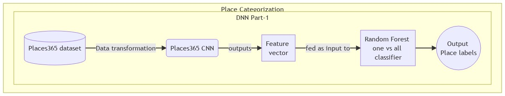
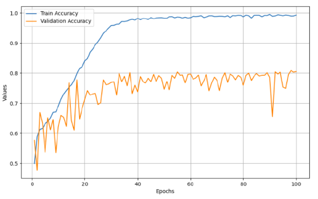

# Expandable image classification system (Places365 Convnet + One vs All Random Forest Classifier)



## Author

- [@Jithin Sasikumar](https://www.github.com/Jithsaavvy)

## Description

This research project trains an `expandable image classification` system for **place categorization**. An expandable image classification system proposed in [1] which is capable of recognizing new classes is used in order to overcome the **closed-set limitation** of `Convolutional Neural Network (convnet)`. The state-of-the-art [Places365 convnet](https://github.com/CSAILVision/places365) is trained using Places365 dataset with one vs all random forest classifier that outputs place labels.

### Why expandable image classification?

Convnets are a popular choice for image classification model as
they generalize well and do not require re-training for a given environment. But, they can only recognize the classes on which they have been trained on, which is their major limitation called `closed-set limitation`. This is not suitable for any dynamic environments. In order to nullify this limitation, expandable image classification system is proposed to recognize new labels in which it hasn't been trained on.

## Install Dependencies

```bash
    pip install -r requirements.txt
```
## Dataset

`Places365` dataset is used for training and testing of the place classification model. It consists of RGB images belonging to $365$ categories of outdoor and indoor locations. For this project, only three categories namely, kitchen, corridor and office are used.

## Methodology

1. The preprocessing of Places365 dataset is defined in [preprocess_data.py](./preprocess_data.py). It is done in two ways:
     - Standard data shuffling, cleaning and transformation
    - Data augmentation using `ImageDataGenerator`

2. [Places365 convnet](https://github.com/CSAILVision/places365) uses [Alexnet](https://en.wikipedia.org/wiki/AlexNet) architecture which will be trained on `places365` dataset. The implementation is given in [placescnn.py](./placescnn.py) that uses standard data preprocessing procedure with no augmentation. [placescnn_augment.py](./placescnn_augment.py.py) uses data augmentation as part of preprocessing. Click [here](./images/Model%20architecture.jpg) for the model architecture.

3. For expandable image classification system, the conventional model is tweaked by removing the final `softmax` layer that outputs class probabilities. Instead, the output of `fully connected layer 2` gives the `feature vector` representation of size `4096`. The model is trained to learn those representations. Literally, the model plays the role of **feature extractor**, which convert the images to feature vectors.

4. Now, the feature vectors are fed as input to `one vs all random forest classifier` which learns to predict place labels from those input vectors.

5. By this way, the system can make predictions on new data, on which it hasn't seen during training.

## Results

### Accuracy plot


**Note: The code is not well structured!!!**

## References

[1] Niko Suenderhauf, Feras Dayoub, Sean McMahon, Ben Talbot, Ruth Schulz,
Peter Corke, Gordon Wyeth, Ben Upcroft, and Michael Milford. Place categorization and semantic mapping on a mobile robot. In 2016 IEEE international conference on robotics and automation (ICRA), pages 5729–5736. IEEE, 2016
